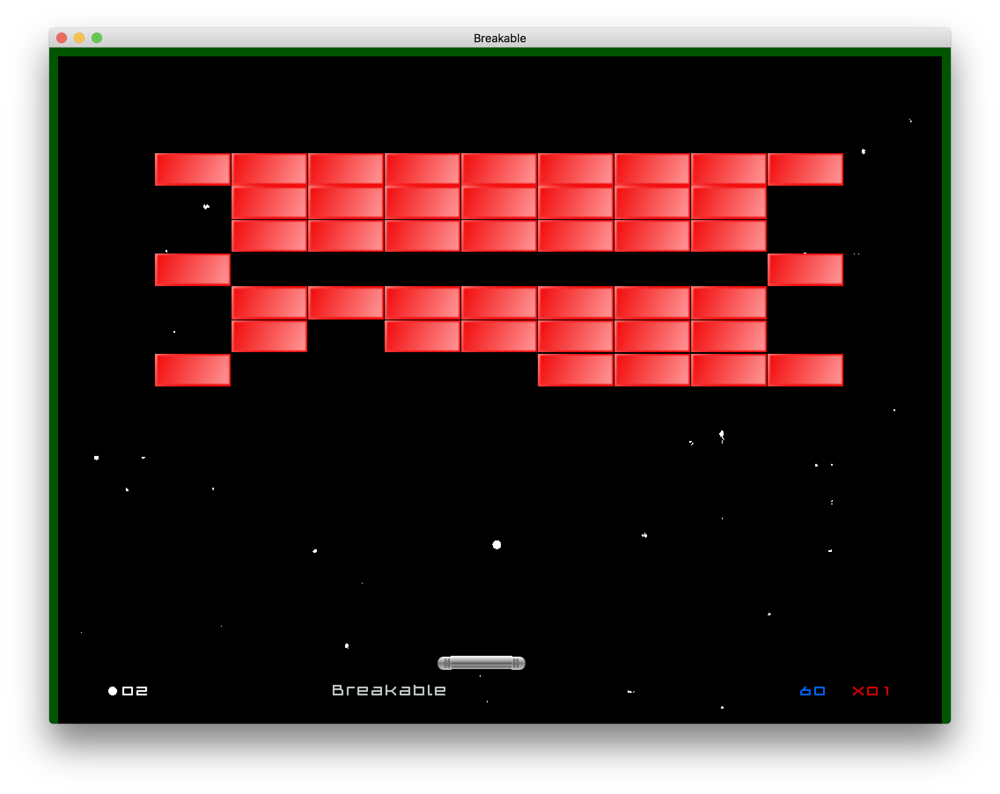

# Breakable
A breakout-like game made with Godot Engine

I made this game to learn Godot and test various features.

### Godot 3.2
The master branch is now compatible with Godot 3.2.x.
The Godot 2.x version is still available in the [Godot 2.1 branch](https://github.com/didier-v/breakable/tree/Godot-2.1).
 - new $ syntax for get_nodes
 - rewrote code incompatible with the new physics engine
 - small fixes and improvements

### Godot 2.1
 - tres format for theme

### Godot 2.0
 - tscn format readable scenes
 - autoload singletons
 - onready option

### Things I learned
 - Autoload magic
 - How to switch scenes
 - Loading and saving a file (user options)
 - Loading and saving an encrypted file (hi scores)
 - How to manage multiple languages
 - How to use fonts
 - How to use a theme
 - Window / Full screen
 - How to import and play sounds
 - Physics and collisions 2D
 - Collisions layers
 - How to add and remove instances with code
 - Connect an event on a UI element to a script
 - Use animations on UI elements
 - Animation with call function track
 - How to make a generic, reusable canvas item (see walls)
 - How to use a shader as a background
	

This project also uses my [Godot Notification Center](https://github.com/didier-v/GodotNotificationCenter) in various ways.

The sounds were made with [Cfxr](http://thirdcog.eu/apps/cfxr).

# License
MIT
